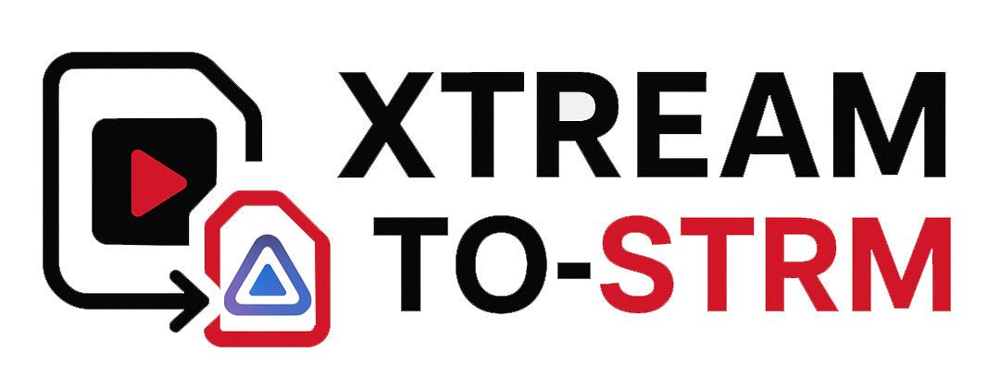

# Xtream to STRM

<div align="center">



**A complete media management platform for Xtream Codes and M3U playlists**  
Generate `.strm` files, download content, and create dynamic M3U playlists for your media server

[](https://opensource.org/licenses/MIT)
[](https://hub.docker.com/r/mourabena2ui/xtream-to-strm-web)
[](https://hub.docker.com/r/mourabena2ui/xtream-to-strm-web)
[](https://github.com/mourabenapi-ux/xtream-to-strm-web/releases)

</div>

---

## 🌟 Overview

Xtream to STRM is a complete, production-ready media management platform that offers **four powerful modules**:

1. **STRM Generator** - Transform Xtream Codes and M3U playlists into Jellyfin/Kodi-compatible `.strm` and `.nfo` files
2. **Download Manager** - Browse and download media directly to your server with intelligent queue management
3. **Live TV Server** - Generate dynamic M3U playlists from your Xtream subscriptions for IPTV players
4. **Auto-Monitoring** - Automatically detect and download new episodes from monitored series

Built with modern technologies, it provides an intuitive interface for managing your entire media workflow with advanced features like selective synchronization, parallel processing, intelligent metadata generation, and comprehensive administration tools.

## ✨ Key Features

### 🎬 Multi-Source Support
- **Xtream Codes**: Full support for Xtream API with multi-subscription management
- **M3U Playlists**: Import from URLs or file uploads with group-based selection
- **Live TV**: Dynamic M3U playlist generation for IPTV players (VLC, TiviMate, etc.)

### 🎯 Smart Synchronization
- **Parallel Fetching**: High-performance sync with concurrent metadata fetching (async/await)
- **Selective Sync**: Choose specific categories or groups to synchronize
- **Incremental Updates**: Only sync what's changed since last update
- **Dual Control**: Separate sync for Movies and Series
- **Robustness**: Redirect support and improved error handling for Xtream providers

### 📋 Rich Metadata
- **NFO Generation**: Detailed metadata files in Jellyfin format
- **TMDB Integration**: Automatic movie/series information enrichment
- **Smart Folder Structure**: 
  - Movies: `Movie Name {tmdb-ID}` folder support
  - Series: Optional `Season XX` subfolders
- **Configurable Formatting**: Title prefix cleaning, date formatting, and name normalization

### 🎨 Modern Interface
- **Responsive Design**: Works seamlessly on desktop and mobile
- **Real-Time Updates**: Live sync progress and status monitoring
- **Dark Mode**: Beautiful, comfortable viewing experience
- **Intuitive Navigation**: Clean organization with logical menu structure

### 📥 Download Manager
- **Direct Downloads**: Browse and download movies/series directly to your server
- **Smart Queue**: Intelligent download queue with configurable parallel limits
- **Auto-Monitoring**: Watch for new episodes and download automatically
- **Category Monitoring**: Monitor entire series categories for bulk downloads
- **Progress Tracking**: Real-time download progress with speed and ETA

### 📺 Live TV Architecture v2
- **Virtual Bouquets**: Create, rename, and reorder custom bouquets from multiple subscriptions
- **Live Composer**: Powerful drag-and-drop interface for channel organization
- **One-Click Discovery**: Fast category browser for quick channel selection
- **Undo/Redo**: Full history system for all layout and configuration changes
- **Centralized EPG Library** *(New in v4.0.0)*: Define global EPG sources once and link them to any playlist
- **Weighted Auto-Match**: Intelligent channel-EPG pairing using a composite score weighted by source priority
- **Compact Mode**: High-density view toggle for managing large channel lists efficiently
- **Bulk Operations**: Rapidly add, move, or delete hundreds of channels
- **Smart Filtering**: Real-time filtering by channel name, group, or subscription
- **Dynamic M3U Server**: Single, high-performance URL that updates instantly

### 🛠️ Advanced Administration
- **Command Center Dashboard** *(New in v4.0.0)*: Real-time system health, task monitoring, and quick actions
- **Database Management**: Easy reset and cleanup operations
- **File Management**: Bulk delete and reorganization tools
- **NFO Settings**: Customize title formatting with regex patterns
- **Real-Time Logs**: Stream application logs directly in the browser

## 🚀 Quick Start

### Installation from Docker Hub (Recommended)

```bash
docker run -d \
  -p 8000:8000 \
  -v $(pwd)/output:/output \
  -v $(pwd)/db:/db \
  --name xtream-to-strm \
  mourabena2ui/xtream-to-strm-web:4.2.0
```

Available tags: `4.2.0` (pin this in production), `4.2`, `latest`.

Access the web interface at **http://localhost:8000**

> 🔐 **Run it on your LAN only.** The web interface has no authentication, and your
> provider credentials are stored in clear text in the SQLite database under `db/`.
> Do not expose port 8000 to the internet; put it behind a VPN or a reverse proxy with
> its own authentication if you need remote access.

### Using Docker Compose

```yaml
services:
  app:
    image: mourabena2ui/xtream-to-strm-web:4.2.0
    container_name: xtream_app
    environment:
      - TZ=Europe/Paris
    ports:
      - "8000:8000"
    volumes:
      - ./output:/output
      - ./db:/db
    restart: unless-stopped
```

Then start with:
```bash
docker-compose up -d
```

## 📖 Usage

### 1. Add Your Content Source

**For Xtream Codes:**
- Navigate to **XtreamTV** → **Subscriptions**
- Add your subscription details (URL, username, password)
- Configure movie and series output directories

**For M3U Playlists:**
- Navigate to **M3U Import** → **Sources**
- Add source via URL or file upload
- Configure output directory

### 2. Select Content to Sync

**For Xtream:**
- Go to **XtreamTV** → **Bouquet Selection**
- List available categories
- Select categories for movies and/or series

**For M3U:**
- Go to **M3U Import** → **Group Selection**
- Select your source
- Choose groups for movies and/or series

### 3. Synchronize

Click **Sync Movies** or **Sync Series** to generate your files!

### 4. Download Content (Optional)

**Browse and Download:**
- Navigate to **Downloads** → **Media Selection**
- Browse available movies and series
- Add items to download queue
- Monitor downloads in **Download Manager**

**Auto-Monitoring:**
- Go to **Downloads** → **Monitoring**
- Add series or categories to watch
- New episodes download automatically

### 5. Live TV M3U (Optional)

**Generate Your Playlist:**
- Navigate to **Live TV** → **Live Selection**
- Select your subscription
- Click refresh to load bouquets
- Choose categories to include
- Copy or download your M3U URL
- Add URL to your IPTV player

### 6. Configure Your Media Server

Point Jellyfin to the `/output` directory to scan your new content. The generated files follow Jellyfin's naming conventions for optimal recognition.

## 🎛️ NFO Configuration

Customize how titles are formatted in NFO files:

| Setting | Description | Example |
|---------|-------------|---------|
| **Prefix Regex** | Strip language/country prefixes | `FR - Movie` → `Movie` |
| **Format Date** | Move year to parentheses | `Name_2024` → `Name (2024)` |
| **Clean Name** | Replace underscores with spaces | `My_Movie` → `My Movie` |

Access these settings in **Administration** → **NFO Settings**

## 📁 Generated File Structure

```
output/
├── movies/
│   └── Movie Name (2024)/
│       ├── Movie Name (2024).strm
│       └── Movie Name (2024).nfo
└── series/
    └── Series Name/
        ├── Season 01/
        │   ├── S01E01 - Episode Title.strm
        │   └── S01E01 - Episode Title.nfo
        └── tvshow.nfo
```

## 🔧 Technology Stack

- **Backend**: Python 3.11, FastAPI, SQLAlchemy, Celery
- **Frontend**: React 18, TypeScript, Vite, TailwindCSS
- **Infrastructure**: Redis, SQLite
- **Containerization**: Docker (multi-stage build)

## 📝 Version History

### v4.2.0 (Current)

A hardening release. Every item below was reproduced against a live provider, a real
149 MB XMLTV guide and a 3 700-item library, then re-verified after the fix.

> ⚠️ **Two behaviour changes to read before upgrading** — see *Upgrading to v4.2.0* below.

**Sync & library generation**
- 🧨 **Fixed: an empty bouquet selection synced the entire catalogue.** Clearing every tick box skipped the category filter instead of applying it, walking 178 434 movies / 38 547 series. The filter is now applied unconditionally, and an empty selection means *nothing selected* — the generated library for that type is removed.
- 🧨 **Fixed: a provider returning an empty catalogue wiped the library.** An empty response is now treated as a provider fault, not as "the user removed everything".
- ♻️ **Deletion is disk-driven, not database-driven.** Rebuilding paths from cached names left orphans behind forever when a provider renamed a title. A post-sync sweep now removes any unaccounted `.strm`/`.nfo` under the library and prunes empty folders. A series that was not reprocessed, and any item whose refresh *failed*, keep their files untouched.
- 🔢 **Duplicate catalogue entries no longer overwrite each other.** Same-name entries become `Title`, `Title (2)`, `Title (3)`, ranked by sorted `stream_id` so names stay stable across syncs.
- 📺 **Ongoing series now gain their new episodes.** Episodes were only re-fetched when the series *name* changed. A provider `last_modified` stamp plus an age fallback (`SERIES_REFRESH_HOURS`, default 12) now drive the refresh.
- 🧩 **Fixed: `"info": []` aborted every series at episode 2.** 89 of 98 episodes were lost on providers sending that shape.
- ✂️ **Cleaner episode filenames** — `S01E01 - AMZ - Show - S01E01 - EPISODE ONE.strm` is now `S01E01 - EPISODE ONE.strm`.
- 📁 **Every movie gets its own folder**, instead of untagged titles landing loose in the library root.
- 🔏 **A layout signature forces a one-time rebuild** when the naming or folder rules change, so a settings change no longer leaves the library in its old shape.
- ✅ **Honest sync reporting**: a new `partial` status, counts of what was actually written (not of the to-do list), stale error messages cleared on a clean run, and the message finally rendered in the UI.
- 🔄 **A sync killed mid-flight no longer stays `running` forever** — leftover rows are reconciled to `failed` at startup.

**EPG / TiviMate**
- 📡 **The provider's native XMLTV guide is implemented** (`xmltv.php`) — it was a bare `pass`. Verified at 66 MB / 4 441 channels. The UI never renders the real URL, which carries the password.
- 🕐 **EPG timezone fixed.** Source offsets are honoured instead of stripped, and emitted timestamps are real UTC rather than local time labelled `+0000`.
- ▶️ **The now-playing slot was always empty** — the query excluded the programme currently on air and started the guide at the next one.
- 🎯 **Auto-match rewritten.** Two channels could claim one EPG id, a fuzzy fallback matched any short name inside any longer one, and the final score gate was mathematically unreachable. Now: exact match on the provider's declared `epg_channel_id` first, strict thresholds, and a greedy 1:1 assignment. Measured on a real 785-channel guide: 12/15 → **15/15**.
- 🗺️ **One resolver for M3U, guide and validation.** The M3U advertised `tvg-id`s the guide never described; one playlist went from 1 described channel to 11.
- 📊 **The XMLTV generator picks a source that actually has programmes**, not merely the first that lists the channel. Verified: 0 → 219 programmes.
- 🏷️ **`tvg-id="None"` eliminated**, and `x-tvg-url` is now absolute.

**Downloads**
- 🎞️ **Fixed: the `.mp4` extension was hardcoded**, which failed every download on providers serving `.mkv`.
- 🧊 **Frozen download queue fixed** with a Redis heartbeat — a dead download frees its slot in ≤ 5 min instead of 1 h.
- 📉 **Silent truncation fixed**: a mid-stream cut now resumes via HTTP `Range`, and a size guard runs before marking a download complete. Verified on a 3.4 GB file cut at 102 MB.
- 🗂️ **NFOs are written for downloads too** (movie NFO, `tvshow.nfo` + episode NFO), and each subscription gets its own download subfolder so two providers cannot collide.
- 🔎 **Paginated browse**: initial load went from 28 MB to 26 KB.

**Stability & UI**
- 🧠 **EPG memory leak fixed** — streaming `iterparse` plus worker recycling. Workers: ~1.5 GB → ~93 MB; container 3.67 GB → 876 MB.
- 🩺 **All six dashboard endpoints were hard 500s** (they read model fields that never existed) and are now correct, including live in-progress task counts.
- 🛡️ **Data-loss hazard removed**: all deletions go through a single guarded helper, with protected roots that the sweeper never enters.
- 🔔 **Toast + typed-confirmation system** across the app; every native `alert()`/`confirm()` removed. Destructive actions require typing the confirmation word.
- 🖥️ Log viewer pause actually pauses, with level filters and search; dead dashboard links repaired; renames survive a channel move; M3U upload keeps its directory fields.

### Upgrading to v4.2.0

1. **Back up `db/` before upgrading.** The container adds columns on first start.
2. **An empty bouquet selection now deletes.** Previously it synced everything. If any subscription has no bouquet ticked, tick what you want *before* the first sync on v4.2.0.
3. **The first sync rebuilds the whole library once.** The naming rules changed (per-movie folders, duplicate suffixes, cleaner episode titles), so the layout signature triggers one full regeneration. Expect a long first run; subsequent runs are incremental.

### v4.1.1 – v4.1.6

Docker Hub image republishes only — same application code as v4.0.0, no functional change.
The `latest` tag published on 2026-02-19 added `ffmpeg` to the image (used as the download
fallback), which is why it is larger than the `v4.1.x` tags.

### v4.0.0
- 🌐 **Global EPG Library**: Centralized EPG source management — define once, link to any playlist
- 🔗 **Playlist-EPG Linking**: Link multiple XMLTV sources to a playlist with drag-and-drop priority
- 🤖 **Weighted Auto-Match**: Intelligent channel pairing using composite scoring weighted by source priority
- 🔄 **Background EPG Refresh**: Configurable auto-refresh intervals with Celery-beat scheduling
- 📊 **Command Center Dashboard**: Complete redesign with hero stats, system health, active task monitor, and quick actions
- 🗜️ **Compact Mode**: High-density toggle for the Live Selection page — smaller rows, hidden secondary info, more channels visible
- 🧭 **Restructured Navigation**: Sidebar reorganized into logical "to STRM", "Management", and "System" sections
- 🗄️ **Data Migration**: Automated migration script to convert legacy per-playlist EPG data to the new global architecture
- 🐞 **Stability**: Fixed TypeScript build errors and improved API error handling

### v3.9.1
- ✍️ **Inline Rename**: Click directly on a channel name in the Composite List to rename it instantly
- 🔢 **Jump to Position**: Type a position number to instantly reorder a channel within a bouquet
- 🎯 **Drag-and-Drop Validation**: Ensured no conflicts between inline editing and sortable interactions

### v3.8.0
- ⚡ **Virtual Scrolling**: Integrated `react-window` for buttery-smooth rendering of 10,000+ channel lists
- 📄 **Paginated API**: Backend streams endpoint returns paginated results for reduced memory usage
- 🔁 **Incremental Sync**: Only changed content is re-synced, dramatically reducing sync time
- 🧠 **Redis Caching**: Xtream metadata cached in Redis for faster repeat access

### v3.7.1
- 🗜️ **Collapsible Panels**: Source Explorer and Virtual Groups panels can be collapsed to give the Composite List more space
- 📐 **Multi-Column Layout**: Composite List dynamically switches to 2 or 3 columns when panels are collapsed
- ♻️ **Auto-Save Indicator**: Replaced the manual "Save" button with an automatic persistence indicator
- 🔄 **Reset Confirmation**: Improved reset dialog with explicit warnings about data loss
- 📡 **EPG Page Access**: Added a playlist selector for direct EPG access without requiring Live Selection context

### v3.7.0
- 🚀 **Live TV v2**: Complete architectural overhaul with high-performance virtual bouquets
- ✍️ **Customization**: Rename and reorder channels with a persistent custom order
- 🔄 **Undo/Redo System**: Integrated history management for all Live TV operations
- 📁 **Bouquet Composer**: Modern split-pane UI for rapid channel organization
- 📡 **Multi-Source EPG**: Support for multiple XMLTV sources with full management UI
- ⚡ **Performance Ops**: 3x faster API synchronization and elimination of redundant redirects
- 🐞 **Stabilization**: Fixed critical 422/500 bulk delete and 404 rename errors

### v3.1.0
- 📺 **Live TV Module**: New dedicated module for managing Live TV channels from Xtream subscriptions
- 🎯 **Bouquet Management**: Select specific bouquets and exclude individual channels
- 📡 **Dynamic M3U Server**: Generate personalized M3U playlists with a single URL
- 🔧 **Pydantic Schemas**: Improved API serialization for better performance and reliability
- 🛠️ **XtreamClient Enhancement**: Added async methods for Live TV categories and streams
- 📱 **Live Selection UI**: New split-pane interface for managing bouquets and channels

### v3.0.4 (Hotfix)
- 💉 **Engine-Level Schema Healing**: Replaced external SQL scripts with native SQLAlchemy inspection. The application now automatically detects and adds missing columns on startup using its internal engine.
- 🩺 **Ultimate Reliability**: Final resolution for the `no such column` errors reported by users upgrading from v2.6.x.

### v3.0.3 (Hotfix)
- 🛡️ **Definitive Migration Fix**: Combined import-based and subprocess-based migration triggers for absolute reliability.
- 🩺 **Schema Verification**: Added a startup check that verifies the existence of critical columns and logs clear error messages if issues persist.
- 📦 **Package Support**: Added `__init__.py` to migrations to fix Python package resolution issues.

### v3.0.2 (Hotfix)
- 🧪 **Migration Stability**: Integrated database migration triggers directly into `main.py` for guaranteed execution across all environments.
- 🔧 **Path Resolution**: Robust database path discovery in migration scripts (supports relative and absolute paths).

### v3.0.1 (Hotfix)
- 🔧 **Database Migration**: Added automated SQL migration system to handle schema updates for existing users (fixing `no such column` errors).
- 🐳 **Docker Startup**: Improved `docker_start.sh` to apply migrations before starting the application.

### v3.0.0
- ✨ **Introduced Download Module**: New system to browse and download media directly to your server.
- ✨ **Auto-Download Monitoring**: Monitor movies, series, and **series categories** for new automatic downloads.
- ✨ **Intelligent Queue**: Optimized download queue with strict `max_parallel_downloads` enforcement and bulk-add performance.
- 🔧 **Enhanced Path Resolution**: Better folder structure (Category/Series/Season) and direct Xtream API fallback for metadata.
- 🔧 **Sanitization**: Improved title cleaning to handle separators and country prefixes.
- 🛠️ **Deep Analysis**: Refined various backend components for better concurrency and data type consistency.

### v2.6.1 (Latest)
- 🌍 **Timezone Support**: Added full support for local server time via `TZ` environment variable (default: `Europe/Paris`).
- 🕒 **Core Engine**: Migrated all backend logic from UTC to local time for accurate task scheduling and logging.
- 🎨 **UI Fix**: Implemented `formatDateTime` to prevent browser timezone shifts, ensuring consistency between server logs and dashboard.
- 🐳 **Docker**: Optimized container startup and environment configuration for timezone persistence.

### v2.6.0
- ✨ **Performance**: Parallel fetching engine with **configurable concurrency settings** via UI.
- ✨ **Logs**: New real-time log streaming interface for live monitoring.
- ✨ **Metadata**: TMDB ID folder support `Movie {tmdb-ID}` for perfect matching.
- ✨ **Series**: Configurable Season folders & Episode filename formatting.
- 🔒 **Security**: Switched to non-root container user (`appuser`) and added protected routes.
- 🛠️ **Admin**: Granular Cache Clearing tools & Smart Database Reset (preserves settings).
- 🐞 Fixed redirect handling for IPTV providers and corrected hardcoded versioning.

### v2.5.0
- ✨ Enhanced NFO title formatting options
- ✨ Configurable regex for prefix stripping
- ✨ Date formatting at end of titles
- ✨ Name cleaning (underscore replacement)
- 🎨 New application logo
- 🐛 Fixed config endpoint routing
- 🐛 Improved M3U sync with NFO generation

### v2.0.0
- ✨ Added M3U playlist support
- ✨ Refactored UI structure
- ✨ Split sync controls for Movies/Series
- 🎨 Enhanced dashboard and navigation

## 📄 License

This project is licensed under the MIT License - see the [LICENSE](LICENSE) file for details.

## 🤝 Contributing

Contributions are welcome! Please feel free to submit a Pull Request.

## 💬 Support

- **Issues**: [GitHub Issues](https://github.com/mourabenapi-ux/xtream-to-strm-web/issues)
- **Docker Hub**: [mourabena2ui/xtream-to-strm-web](https://hub.docker.com/r/mourabena2ui/xtream-to-strm-web)

## ☕ Support This Project

If you find this project helpful, consider supporting its development!

<a href="https://www.buymeacoffee.com/mourabena" target="_blank"></a>

Your support helps maintain and improve this project. Thank you! 🙏

---

<div align="center">

**Made with ❤️ for the Jellyfin and Kodi community**

[Docker Hub](https://hub.docker.com/r/mourabena2ui/xtream-to-strm-web) • [GitHub](https://github.com/mourabenapi-ux/xtream-to-strm-web)

</div>
